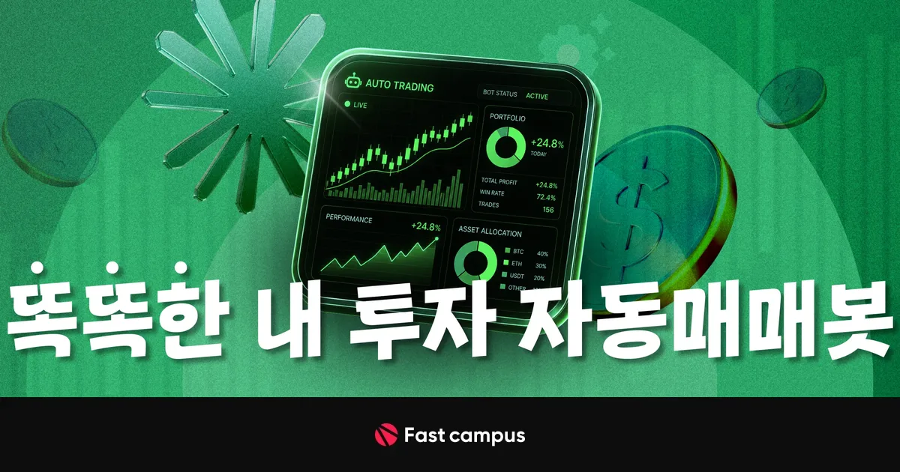
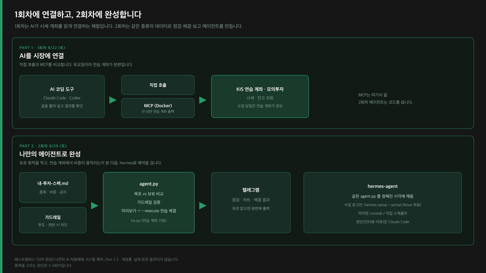
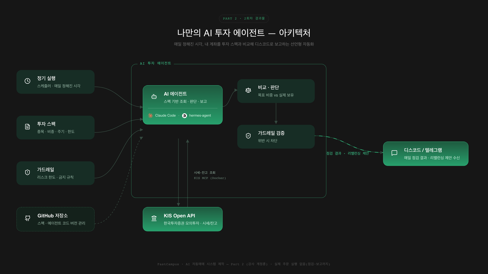

# AI 자동매매 시스템 제작 — 실습 저장소 (ai-trading-lab)

<a href="https://fastcampus.co.kr/fin_thecamp_aitrading">
  
</a>

> **[4주 완성] 나만의 AI 자동매매 시스템 제작** ·
> [강의 보기](https://fastcampus.co.kr/fin_thecamp_aitrading)

패스트캠퍼스 오프라인 강의 **Part 1~2 (정훈)** 의 실습 저장소입니다.
코딩을 몰라도, **프롬프트를 복사해 붙여넣으며** 따라오면 끝에는 동작하는 시스템이 남습니다.

> **범위: 4주 중 Part 1~2 (1·2회차) 만 다룹니다.**
> Part 3~4 는 다른 강사님이 별도 자료로 진행하며, 이 저장소에는 포함되지 않습니다.

## ▶ STEP 0 — 여기서 시작 (복붙 한 번이면 됩니다)

AI 코딩 도구(Claude Code 등)에서 이 폴더를 열고, 아래를 그대로 붙여넣으세요.
API 키도, 설치 지식도 필요 없습니다.

```text
지금 열려 있는 폴더가 이 실습 저장소의 루트인지 확인해줘 (verify.py 와 lessons 폴더가 보여야 해).
Python 3.10 이상이 있는지 확인하고, 없으면 내 OS에 맞게 설치를 도와줘.
준비되면 python verify.py 를 실행해줘 — API 키 없이 mock 모드로 도는 게 정상이야.
실패하면 내가 명령어를 직접 치지 않도록, 네가 원인을 설명하고 고쳐줘.
3/3 통과가 나오면 다음으로 열 파일이 lessons/0-시작/README.md 라고 알려줘.
```

- ✅ **통과**: `결과: 3/3 통과` 가 보인다 → STEP 1로.
- ⛔ **막힘**: 에러가 보인다 → 그 화면 그대로 AI에게 보여주며
  `".agents/skills/troubleshooting/SKILL.md 대로 고쳐줘"` 라고 하세요.

## 🗺️ STEP 지도 — 전체 여정과 통과 기준

각 STEP의 문서를 열면 **목표 → 복사용 프롬프트 → 실행 → 다음 단계**가 있습니다.
아래 ✅가 보이면 통과, 안 보이면 ⛔ 규칙(표 아래)대로 하면 됩니다.

| STEP | 무엇을 하나 | 여는 문서 | ✅ 통과 기준 (이게 보이면 다음으로) |
|---|---|---|---|
| **0** | 환경 준비 | 위 프롬프트 · [`lessons/0-시작/1-환경-세팅.md`](lessons/0-시작/1-환경-세팅.md) | `결과: 3/3 통과` |
| **1** | 핵심 개념 | [`lessons/0-시작/2-개념-정보전달과-MCP.md`](lessons/0-시작/2-개념-정보전달과-MCP.md) | "정보는 양이 아니라 구조로"를 내 말로 설명 가능 (실행 없음) |
| **2** | 직접 호출 | [`lessons/1부-연결/1-직접-호출.md`](lessons/1부-연결/1-직접-호출.md) | `005930 현재가: …원` 이 터미널에 출력 |
| **3** | MCP 연결 ★1회차 핵심 | [`lessons/1부-연결/2-MCP-연결.md`](lessons/1부-연결/2-MCP-연결.md) | 자연어로 물었는데 AI가 도구를 스스로 골라 시세·잔고를 답함 |
| **4** | 에이전트 첫 실행 | [`lessons/2부-나만의-에이전트/1-예제-실행.md`](lessons/2부-나만의-에이전트/1-예제-실행.md) | 점검 보고 미리보기 + `※ 미리보기입니다` 표시 |
| **5** | 내 원칙을 스펙으로 | [`lessons/2부-나만의-에이전트/2-스펙-수정.md`](lessons/2부-나만의-에이전트/2-스펙-수정.md) | 스펙 반영 후에도 `python verify.py` 3/3 유지 |
| **6** | 리밸런싱 실행 | [`lessons/2부-나만의-에이전트/3-재실행-리밸런싱.md`](lessons/2부-나만의-에이전트/3-재실행-리밸런싱.md) | `--execute` 로 모의주문 결과, 한도 초과 시엔 가드레일 차단 |
| **7** | 자동화 ★2회차 완성 | [`lessons/2부-나만의-에이전트/4-자동화-hermes-예약.md`](lessons/2부-나만의-에이전트/4-자동화-hermes-예약.md) | 정해진 시각에 **디스코드로 점검 보고** 도착 |
| **끝** | 신뢰 게이트 회고 | [`lessons/9-마무리/README.md`](lessons/9-마무리/README.md) | — |

> ⛔ **어느 STEP에서든 막히면** — 두 문장만 기억하세요.
> - 에러가 났다: `".agents/skills/troubleshooting/SKILL.md 대로 고쳐줘"` + 에러 화면
> - 길을 잃었다: `"리밸이(.agents/skills/assistant/SKILL.md) 대로, 내가 어느 단계인지 진단하고 다음 행동 하나만 알려줘"`

## 1회차에 연결하고, 2회차에 완성합니다



| 파트 | 목표 | 끝나면 |
|---|---|---|
| **1부 · 연결** (1회차, STEP 0~3) | AI를 국내 주식시장(KIS 모의투자)에 연결 | 내 모의계좌를 AI가 실제 조회 |
| **2부 · 에이전트** (2회차, STEP 4~7) | 내 원칙으로 스스로 점검·리밸런싱·보고 | 자는 동안 도는 나만의 에이전트 |
| **3~4부 · 실전** (3·4회차) | 실전 매매 판단·주문 실행 (문상록 강사님) | [별도 실습 저장소](https://github.com/dragon1086/lecture-prism)로 진행 |

1회차에서 만든 **MCP 연결을 그대로 재사용**해, 2회차에 에이전트를 얹습니다.
직접 호출 · KIS MCP · CLI 래퍼 세 경로를 비교해보고, 그중 하나로 계속 갑니다.

## 2회차에 완성되는 것



내가 **마크다운으로 선언한 원칙**(투자 스펙 · 가드레일 스펙)을 AI가 매일 정해진 시각에 읽고,
계좌와 비교해 차이를 계산한 뒤 **디스코드로 보고**합니다.
코딩이 아니라 선언 — 원칙을 바꾸고 싶으면 마크다운만 고치면 됩니다.

> 점검·보고까지입니다. **실제 주문 실행은 없습니다.**

## 강사 소개 — Part 1~2


안녕하세요.
**닫힌 데이터를 AI가 쓸 수 있게 여는 오픈소스 개발자, 계정훈입니다.**

최근 우리가 쓰는 앱과 서비스 안에 갇힌 데이터를 AI가 어떻게 안전하게 활용할 수 있을지에
관심을 갖고 여러 오픈소스 도구를 만들고 있습니다. 그 중 하나가
[tossinvest-cli](https://github.com/JungHoonGhae/tossinvest-cli) 입니다.
공식 API 만으로는 활용하기 어려웠던 토스증권 데이터를 AI 가 읽고 활용할 수 있도록 연결하고,
계좌 · 포트폴리오 · 시세 · 주문 상태를 조회할 수 있는 구조를 만들었습니다.

다만 자동매매에서 중요한 것은 단순히 데이터를 연결하는 것이 아닙니다.
**내 돈이 움직이는 일이기 때문에**, 어디까지 AI 에게 맡길지, 어떤 상황에서 멈추게 할지,
어떻게 확인하고 점검할지가 함께 설계되어야 합니다.
AI 가 실제 데이터를 보고 일하게 만들되, 위험하게 움직이지 않도록 구조를 짜는 것이
자동매매의 핵심이라고 생각합니다.

이번 강의에서는 **안전한 KIS 모의투자 API** 를 기반으로, AI 가 실제 투자 데이터를 읽고,
조건을 확인하고, 결과를 보고하는 자동화 흐름을 함께 만들어볼 예정입니다.
코딩을 몰라도 괜찮습니다. 처음에는 프롬프트를 따라가며 시작하고, 마지막에는
**자는 동안에도 내 계좌를 지켜보는 나만의 자동화 에이전트**가 남을 수 있도록
천천히 안내드리겠습니다.

## 폴더 구조

```
README.md          ← 지금 이 파일 (유일한 진입점 — 여기서만 시작하면 됩니다)
내-투자-스펙.md     ← 여러분이 직접 만지는 유일한 루트 파일
lessons/           ← 학습 문서 (STEP 순서대로: 0-시작 → 1부-연결 → 2부-나만의-에이전트 → 9-마무리 · 참고)
agent/             ← 여러분의 에이전트가 완성되는 곳 (agent.py + spec/ 3개 스펙)
hermes/            ← 자동화용 통합 패키지 (STEP 7에서 사용)
examples/          ← 단계별 실행 스크립트
src/               ← 내부 코드 (KIS 클라이언트 등)
verify.py          ← 자가 점검 (언제든 python verify.py)
```

**코드 폴더(agent·hermes·examples·src)는 직접 열 일이 없습니다** — AI가 알아서 찾아갑니다.
여러분은 이 README와 `lessons/` 문서의 복사용 프롬프트만 따라가면 됩니다.

---
※ 이 저장소는 **모의투자**까지만 다룹니다. 실제 돈이 오가는 실전 매매 기능은 없습니다.
예제 전략은 학습용 예시이며, 수익을 보장하지 않습니다.
