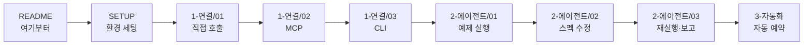
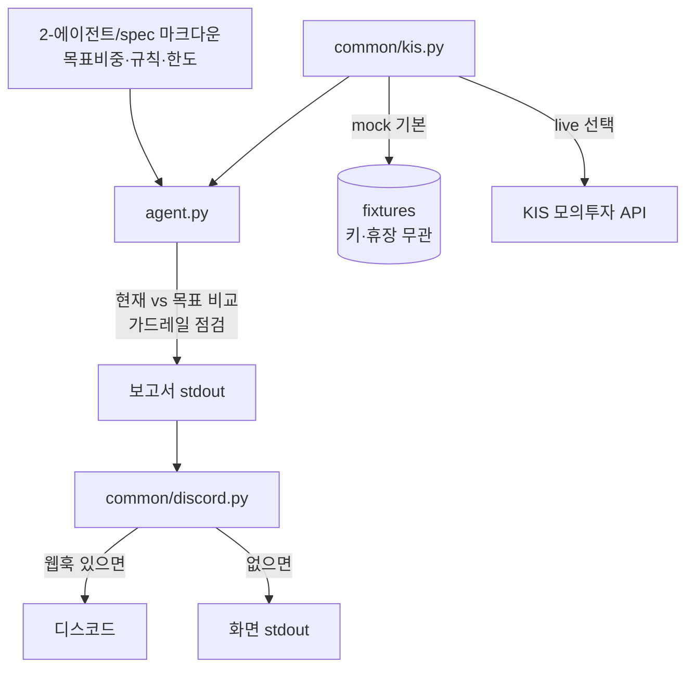
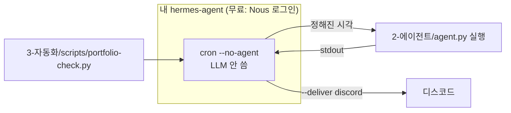

# 아키텍처 한눈에 보기

## 학습 흐름 (학생 여정)

```mermaid
flowchart LR
    A[README<br/>여기부터] --> B[SETUP<br/>환경 세팅]
    B --> C1[1-연결/01<br/>직접 호출]
    C1 --> C2[1-연결/02<br/>MCP]
    C2 --> C3[1-연결/03<br/>CLI]
    C3 --> D1[2-에이전트/01<br/>예제 실행]
    D1 --> D2[2-에이전트/02<br/>스펙 수정]
    D2 --> D3[2-에이전트/03<br/>재실행·보고]
    D3 --> H[3-자동화<br/>자동 예약]
```

## 데이터 흐름 (에이전트가 하는 일)

```mermaid
flowchart TD
    S[2-에이전트/spec 마크다운<br/>목표비중·규칙·한도] --> AG[agent.py]
    K[common/kis.py] --> AG
    K -->|mock 기본| FX[(fixtures<br/>키·휴장 무관)]
    K -->|live 선택| API[KIS 모의투자 API]
    AG -->|현재 vs 목표 비교<br/>가드레일 점검| R[보고서 stdout]
    R --> DC[common/discord.py]
    DC -->|웹훅 있으면| DISCORD[디스코드]
    DC -->|없으면| SCR[화면 stdout]
```

## 자동화 (정해진 시각에 자동 실행)

```mermaid
flowchart LR
    subgraph 내_hermes["내 hermes-agent (무료: Nous 로그인)"]
      CRON["cron --no-agent<br/>LLM 안 씀"]
    end
    SC[3-자동화/scripts/portfolio-check.py] --> CRON
    CRON -->|정해진 시각| RUN[2-에이전트/agent.py 실행]
    RUN -->|stdout| CRON
    CRON -->|--deliver discord| DISCORD[디스코드]
```

> 핵심: 지능(코드 수정·판단)은 학생의 Claude Code/Codex 가, 데이터 처리·보고는 이
> 저장소 코드가, 정기 실행·배달은 hermes 가 맡습니다. 각 층이 분리돼 있습니다.
