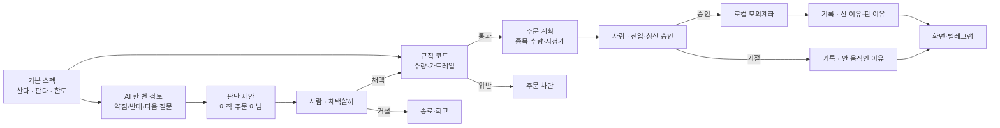
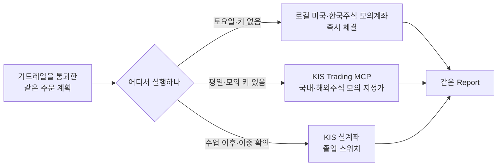
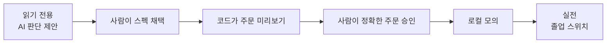
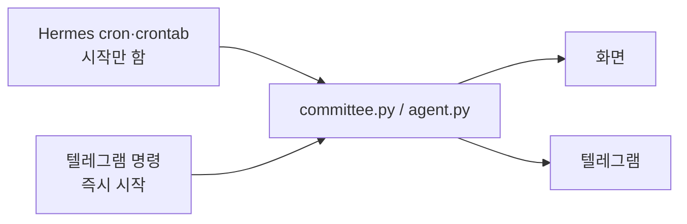

# 아키텍처 한눈에 보기

이 시스템에는 **투자 사이클**과, 그 안에 붙는 **루틴**이 있습니다.
사이클은 진입과 청산입니다. 기록은 산 때·판 때·안 움직였을 때 모두 남깁니다.
루틴은 조건이 맞으면 도는 조각입니다. 사이클 자체에는 트리거가 없습니다. 사람이 승인합니다.

클로드 · 에르메스 · 텔레그램은 **자리**입니다. 같은 일을 다른 앱이 앉을 수 있습니다.

## 전체 흐름

읽는 법은 네 줄입니다.

1. **스펙은 이미 있습니다.** 시총 상위 다섯을 같은 금액으로 담는 표가 기본값입니다.
2. **AI는 제안만 합니다.** 약점과 반대 근거를 말할 뿐 숫자를 바꾸지 않습니다.
3. **코드가 계산하고 막습니다.** 수량과 한도는 문장을 해석하지 않고 숫자로 검사합니다.
4. **사람이 진입·청산을 승인합니다.** 안 눌러도 한 줄을 남깁니다. 그게 사이클이 보이는 방법입니다.

## 누가 어디까지 하나

- **사람**: 스펙을 보고(`/config`) 칸을 고치고(`/update_config`) 진입·청산을 승인합니다. 자리만 바꿀 수 있습니다.
- **규칙 코드**: 확정된 스펙만 읽어 목표와 지금을 비교합니다. 한도를 넘으면 승인 여부와 상관없이 차단합니다.
- **AI 판단층**: 고정 결과를 읽고 약점, 반대 근거, 다음 질문을 제시합니다. 주문 함수를 부르지 않습니다. 클로드 대신 다른 코딩 앱이 앉아도 됩니다.
- **스케줄러**: 정해 둔 시각에 같은 프로그램을 시작할 뿐 판단하지 않습니다. 에르메스 대신 crontab이 앉아도 됩니다.
- **텔레그램**: 같은 결과를 보여 주고 승인을 받는 창구입니다. 전략을 만들지 않습니다.

미국 대형주 후보는 직전 한 달을 빼고 1년 성적으로 줄을 세웁니다. 한국에 같은 규칙을 쓰면 본편으로 쓰지 않습니다. 고점 대비 -10% 하락은 자동 매도가 아니라 재검토 알림입니다.

## 루틴은 사이클이 아닙니다

조건이 맞으면 도는 조각입니다. 진입·청산이 아닙니다.

| 언제 | 루틴 | 트리거 |
|---|---|---|
| 평일 08:00 | 아침 브리핑 | 시각 |
| 값이 닿을 때만 | 가격 도달 | 사건. 그대로면 조용 |
| 평일 16:00 | 마감 브리핑 | 시각 |
| 스펙의 다시 볼 날 | 점검 미리보기 | 주기. 승인은 사람 |
| 원할 때 | 참조 실험 · 저점·고점 | 없음 |

주간·월간·연간 브리핑은 수업 본편이 아닙니다.

## 실행 경로는 세 가지

- 수업 본편은 키와 장 시간에 상관없이 도는 **로컬 모의계좌**입니다.
- 평일 숙제에서 공식 도구가 10분 안에 붙으면 같은 계획을 KIS 해외주식 **모의** 지정가로
  옮겨 볼 수 있습니다. 안 되면 로컬로 회고합니다.
- 실계좌는 수업과 숙제 범위 밖입니다. `KIS_ENV=real`과
  `KIS_REAL_ACK=REAL-MONEY-OK` 두 스위치를 직접 켠 졸업 단계에서만 엽니다.
- 로컬 모의 승인의 한 번 실행을 KIS 다건 주문의 원자적 체결과 같은 말로 쓰지 않습니다.

## 신뢰 게이트

오른쪽으로 갈수록 돈에 가까워집니다. 한 단계를 건너뛰지 않습니다.

## 보고와 자동화

Hermes는 세 차선입니다. 코딩 앱은 읽고 묻고, cron은 시작만 하고, 텔레그램은 보고와
승인을 받습니다. 렌더러는 결과 문장을 다시 해석하지 않습니다.

