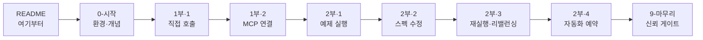
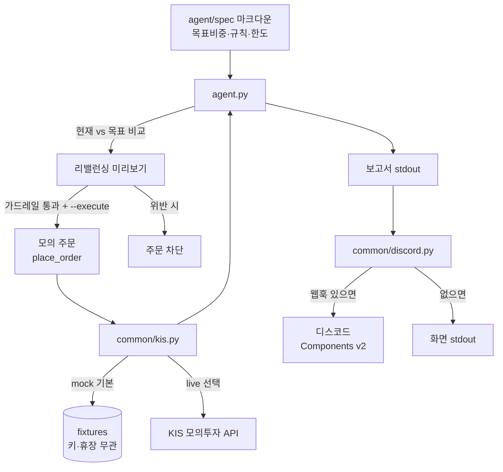
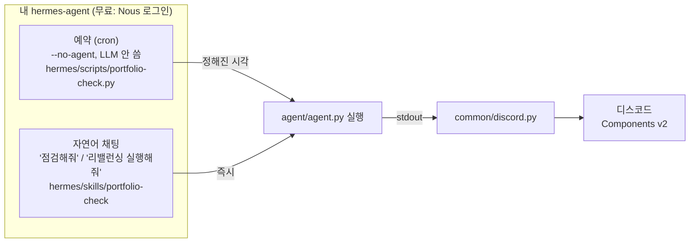

# 아키텍처 한눈에 보기

## 학습 흐름 (학생 여정)

## 데이터 흐름 (에이전트가 하는 일)

> 기본은 미리보기(주문 없음). `--execute` + 가드레일 통과 시에만 모의 주문. 실계좌 아님.

## 자동화 — 에이전트를 깨우는 두 가지 방법 (둘 다 hermes)

> 예약은 "정해진 시각에 알아서", 채팅은 "지금 당장 물어보기" — 실행 로직(`agent.py`)과
> 보고 로직(`discord.py`)은 완전히 같고, 트리거만 다릅니다.

> 핵심: 지능(코드 수정·판단)은 학생의 Claude Code/Codex 가, 데이터 처리·보고는 이
> 저장소 코드가, 정기 실행·배달은 hermes 가 맡습니다. 각 층이 분리돼 있습니다.
