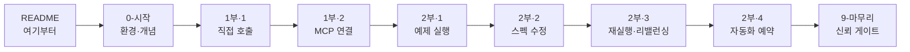
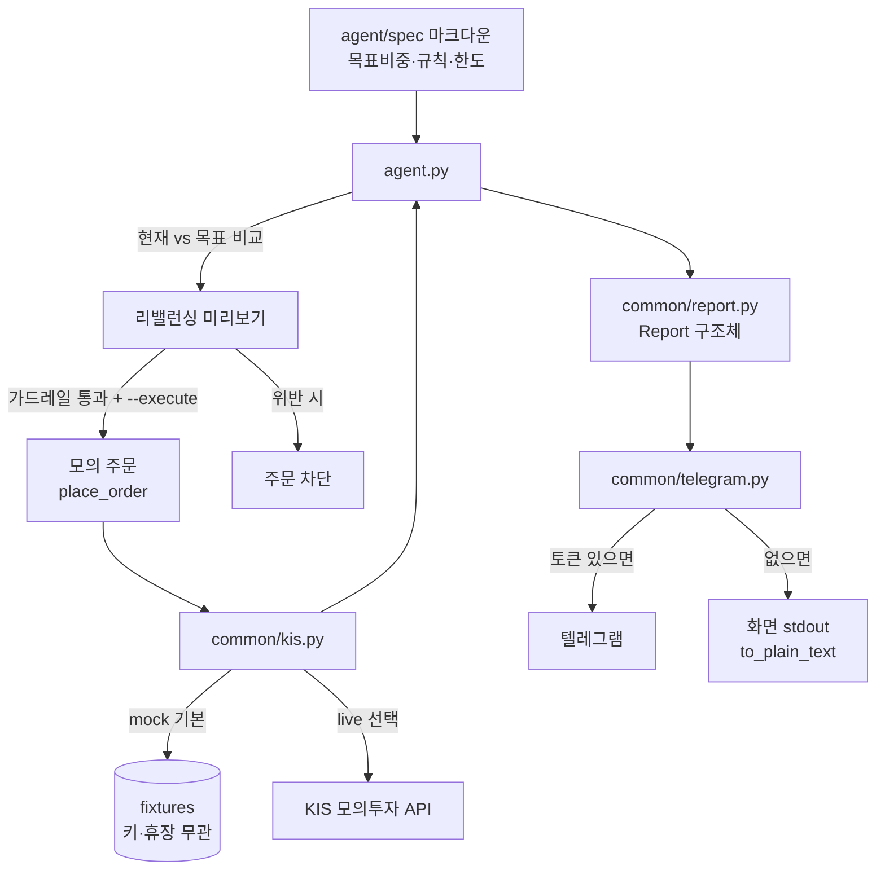
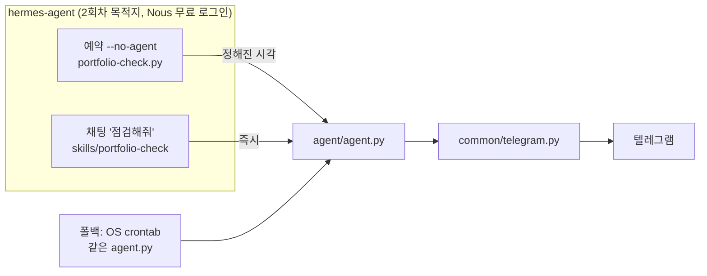

# 아키텍처 한눈에 보기

## 학습 흐름 (학생 여정)

## 데이터 흐름 (에이전트가 하는 일)

> `Report`는 데이터클래스다 — telegram.py는 agent.py가 만든 문구를 다시 파싱하지 않고,
> Report의 필드를 그대로 서식만 입혀 렌더링한다(텔레그램·화면이 같은 Report를 공유).
> 기본은 미리보기(주문 없음). `--execute` + 가드레일 통과 시에만 모의 주문. 실계좌 아님.

## 자동화 — 같은 에이전트를 깨우는 방법

> 실행(`agent.py`)과 보고(`telegram.py`)는 같고, 깨우는 방법만 다릅니다.
> 판단(스펙 인터뷰·리뷰어)은 Claude Code, 자는 동안 깨우기는 hermes.
> 설치가 막히면 crontab 한 줄이 폴백입니다.
